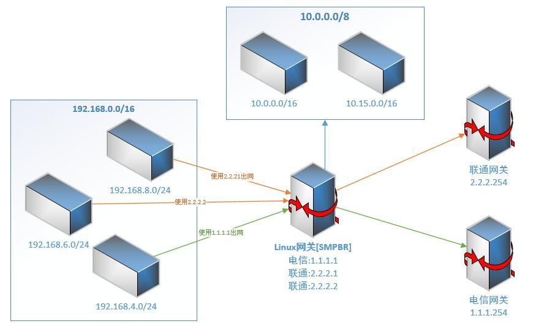

# SMARTPBR #
## 介绍 ##
SmartPBR为一个帮助运维人员快速自动化安装策略路由服务，主要企业使用LINUX网关策略路由组网环境。

##功能 ##

 - 新增路由线路
 - 切换策略

## 已测试编译环境 ##

    Red Hat Enterprise Linux Server release 6.4 (Santiago)
    
## 包含组件 ##
    smartpbr-x.x.x          安装目录        /usr/local/smartpbr        配置文件    /etc/smartpbr
  

##适用拓扑##

 
## 常用命令 ##

    ./smartpbr install    #安装smartpbr
    /etc/init.d/smartpbr  #交互交互式脚本

##安装包内容##

    smartvpn_x.x.x
    │ smartpbr.sh                    #自动化脚本
    │
    └─config                         #配置文件夹
           line                      #线路文件夹
               └─x.config              #线路配置文件
           route.config                #路由配置文件
           rule.config                 #策略配置文件

##配置文件##

**line/*.config**

lt.config

    DEFAULTIP=2.2.2.1
    IP2=2.2.2.2
    GATEWAY=2.2.2.254
    WANDEV=eth0
    
dx.config

    DEFAULTIP=1.1.1.1
    GATEWAY=1.1.1.254
    WANDEV=eth0
    
DEFAULTIP,IP2等等为本线路的出网IP，用于rule.config中调用，GATEWAY:本线路下一条地址，WANDEV本线路所在的网卡

**route.config**

    default
    10.0.0.0/8 via 172.31.0.9 dev tun0

route配置文件，每张路由表中的路由策略均保持一致

**rule.confg** 

    192.168.8.0/24 table lt ip DEFAULTIP
    192.168.6.0/24 table lt ip IP2
    192.168.4.0/24 table dx ip DEFAULTIP
   
rule配置文件，决定IP段使用的路由表以及出网IP，DEFAULTIP/IP2对应相应line/*.config中的IP对应别称

## 手动操作 ##

若特殊情况下需要手动安装，请按照以下规范进行安装

1、添加dxt路由

    vim /etc/iproute2/rt_tables
    252	dxt

2、初始化dxt路由表

    ip route flush table dxt
    #dxt为新增加的路由表

3、增加访问网关的路由(否则自己无法访问网关)

    ip route add 192.168.8.0/24 via 192.168.8.253 dev eth1 table dxt
    #192.168.8.0/24:代表自己的网段,192.168.8.253为网关地址,eth1 代表出网卡,dxt代表路由表

4、增加默认路由

    ip route add default via 124.192.224.33 dev eth0 table dxt
    #Default:代表默认路由,124.192.224.33代表网关,eth0代表出网卡,dxt代表路由表

5、增加策略路由

    ip rule add from 192.168.8.0/24 table dxt
    #192.168.8.253代表网管IP,dxt代表路由表

6、切换SNAT

    iptables -t nat -I POSTROUTING -s 192.168.8.0/24 -j SNAT --to-source 124.192.224.55 
